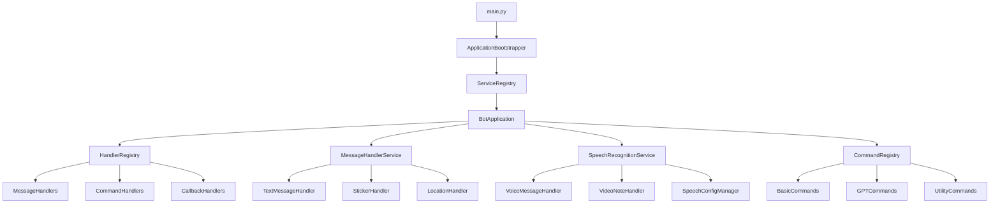

# Design Document

## Overview

This design transforms the monolithic main.py file (793 lines) into a modular, testable architecture following established patterns already present in the codebase. The refactoring leverages the existing ServiceRegistry and ServiceInterface patterns to create a clean separation of concerns while maintaining all current functionality.

The new architecture will consist of specialized components that handle specific responsibilities: application orchestration, message handling, command management, speech recognition, and lifecycle management. Each component will be independently testable and follow dependency injection principles.

## Architecture

### High-Level Architecture



### Component Relationships

The architecture follows a hierarchical service-oriented design:

1. **ApplicationBootstrapper** - Minimal entry point that configures and starts the application
2. **ServiceRegistry** - Central dependency injection container (existing)
3. **BotApplication** - Main orchestrator that coordinates all services (existing, enhanced)
4. **Specialized Services** - Domain-specific services for different bot capabilities
5. **Handler Components** - Focused handlers for specific message types and commands

## Components and Interfaces

### 1. ApplicationBootstrapper

**Purpose**: Minimal entry point that replaces the current main.py logic

**Responsibilities**:
- Configure the service registry with all required services
- Initialize the application orchestrator
- Handle top-level error scenarios
- Manage application lifecycle signals

**Interface**:
```python
class ApplicationBootstrapper:
    def __init__(self) -> None
    async def configure_services(self) -> ServiceRegistry
    async def start_application(self) -> None
    def setup_signal_handlers(self) -> None
    async def shutdown_application(self) -> None
```

### 2. Enhanced BotApplication (Existing)

**Purpose**: Main application orchestrator that coordinates all bot services

**Enhancements**:
- Integration with new specialized services
- Enhanced error handling and recovery
- Improved startup/shutdown coordination
- Better service dependency management

**New Methods**:
```python
async def register_specialized_handlers(self) -> None
async def initialize_speech_services(self) -> None
async def setup_message_processing(self) -> None
```

### 3. MessageHandlerService (Enhanced)

**Purpose**: Centralized message processing and routing

**Responsibilities**:
- Route messages to appropriate handlers based on type
- Manage message history and context
- Handle URL processing and link modification
- Coordinate with GPT response system

**Interface**:
```python
class MessageHandlerService(ServiceInterface):
    def __init__(self, config_manager: ConfigManager, gpt_service: Any) -> None
    async def handle_text_message(self, update: Update, context: CallbackContext) -> None
    async def handle_sticker_message(self, update: Update, context: CallbackContext) -> None
    async def handle_location_message(self, update: Update, context: CallbackContext) -> None
    async def process_urls(self, update: Update, context: CallbackContext, urls: List[str]) -> None
    async def check_random_gpt_response(self, update: Update, context: CallbackContext) -> bool
```

### 4. SpeechRecognitionService

**Purpose**: Dedicated service for all speech recognition functionality

**Responsibilities**:
- Handle voice and video note messages
- Manage speech recognition configuration
- Process speech recognition callbacks
- Handle language selection and fallbacks

**Interface**:
```python
class SpeechRecognitionService(ServiceInterface):
    def __init__(self, config_manager: ConfigManager) -> None
    async def handle_voice_message(self, update: Update, context: CallbackContext) -> None
    async def handle_video_note(self, update: Update, context: CallbackContext) -> None
    async def process_speech_recognition(self, file_id: str, language: str) -> str
    async def handle_language_selection(self, update: Update, context: CallbackContext) -> None
    async def get_speech_config(self, chat_id: str, chat_type: str) -> Optional[Dict[str, Any]]
    async def is_speech_enabled(self, chat_id: str, chat_type: str) -> bool
```

### 5. CommandRegistry

**Purpose**: Centralized command registration and management

**Responsibilities**:
- Register all bot commands with metadata
- Organize commands by category
- Provide command discovery and help generation
- Manage command permissions and access control

**Interface**:
```python
class CommandRegistry(ServiceInterface):
    def __init__(self, command_processor: CommandProcessor) -> None
    async def register_all_commands(self) -> None
    async def register_basic_commands(self) -> None
    async def register_gpt_commands(self) -> None
    async def register_utility_commands(self) -> None
    async def register_speech_commands(self) -> None
    def get_command_list(self) -> List[CommandMetadata]
    def get_help_text(self) -> str
```

### 6. Specialized Message Handlers

**Purpose**: Focused handlers for specific message types

**Components**:
- **TextMessageHandler**: Processes text messages, URL extraction, translation commands
- **StickerHandler**: Handles sticker messages and restriction logic
- **LocationHandler**: Processes location messages
- **PhotoHandler**: Manages photo analysis integration

**Base Interface**:
```python
class BaseMessageHandler(ABC):
    @abstractmethod
    async def can_handle(self, update: Update) -> bool
    @abstractmethod
    async def handle(self, update: Update, context: CallbackContext) -> None
```

### 7. CallbackHandlerService

**Purpose**: Manages all callback query processing

**Responsibilities**:
- Route callback queries to appropriate handlers
- Manage callback data validation and security
- Handle speech recognition callbacks
- Process button interactions

**Interface**:
```python
class CallbackHandlerService(ServiceInterface):
    def __init__(self, speech_service: SpeechRecognitionService) -> None
    async def handle_callback_query(self, update: Update, context: CallbackContext) -> None
    async def route_callback(self, callback_data: str, update: Update, context: CallbackContext) -> None
    def validate_callback_data(self, callback_data: str) -> bool
```

## Data Models

### 1. ServiceConfiguration

```python
@dataclass
class ServiceConfiguration:
    """Configuration for service initialization"""
    telegram_token: str
    error_channel_id: str
    database_url: Optional[str] = None
    redis_url: Optional[str] = None
    debug_mode: bool = False
```

### 2. MessageContext

```python
@dataclass
class MessageContext:
    """Enhanced context for message processing"""
    update: Update
    context: CallbackContext
    user_id: int
    chat_id: int
    chat_type: str
    message_text: Optional[str] = None
    urls: List[str] = field(default_factory=list)
    is_command: bool = False
    requires_gpt_response: bool = False
```

### 3. HandlerMetadata

```python
@dataclass
class HandlerMetadata:
    """Metadata for message handlers"""
    name: str
    description: str
    message_types: List[str]
    priority: int = 0
    enabled: bool = True
```

## Error Handling

### Error Handling Strategy

The refactored architecture maintains the existing error handling patterns while improving error isolation:

1. **Component-Level Error Handling**: Each service handles its own errors and provides fallback behavior
2. **Centralized Error Reporting**: All errors are still reported through the existing error handling system
3. **Graceful Degradation**: Services can continue operating even if dependent services fail
4. **Error Recovery**: Services can recover from transient errors without affecting the entire application

### Error Boundaries

```python
class ServiceErrorBoundary:
    """Error boundary for service operations"""
    
    async def execute_with_boundary(
        self, 
        operation: Callable[[], Awaitable[T]], 
        service_name: str,
        fallback: Optional[Callable[[], Awaitable[T]]] = None
    ) -> Optional[T]:
        try:
            return await operation()
        except Exception as e:
            logger.error(f"Error in {service_name}: {e}", exc_info=True)
            if fallback:
                return await fallback()
            return None
```

## Testing Strategy

### Unit Testing Approach

Each component will have comprehensive unit tests with the following coverage targets:

1. **ApplicationBootstrapper**: 90% coverage
   - Service configuration scenarios
   - Startup and shutdown procedures
   - Error handling during initialization

2. **MessageHandlerService**: 85% coverage
   - Message routing logic
   - URL processing
   - GPT response triggers
   - Error scenarios

3. **SpeechRecognitionService**: 85% coverage
   - Voice message processing
   - Configuration management
   - Language selection logic
   - Error handling

4. **CommandRegistry**: 90% coverage
   - Command registration
   - Help text generation
   - Permission checking

### Integration Testing

Integration tests will verify:
- Service interactions through the ServiceRegistry
- End-to-end message processing flows
- Error propagation and recovery
- Configuration changes affecting multiple services

### Test Structure

```
tests/
├── unit/
│   ├── test_application_bootstrapper.py
│   ├── test_message_handler_service.py
│   ├── test_speech_recognition_service.py
│   ├── test_command_registry.py
│   └── test_callback_handler_service.py
├── integration/
│   ├── test_service_interactions.py
│   ├── test_message_flow.py
│   └── test_error_handling.py
└── fixtures/
    ├── mock_services.py
    └── test_data.py
```

### Mocking Strategy

Each service will be mockable through dependency injection:

```python
# Example test setup
@pytest.fixture
def mock_config_manager():
    return Mock(spec=ConfigManager)

@pytest.fixture
def message_handler_service(mock_config_manager):
    return MessageHandlerService(config_manager=mock_config_manager)
```

## Migration Strategy

### Phase 1: Create New Components
1. Implement ApplicationBootstrapper
2. Create specialized service classes
3. Implement comprehensive unit tests
4. Ensure all new components integrate with existing ServiceRegistry

### Phase 2: Gradual Migration
1. Move command registration to CommandRegistry
2. Extract message handling logic to MessageHandlerService
3. Migrate speech recognition to SpeechRecognitionService
4. Update BotApplication to use new services

### Phase 3: Integration and Testing
1. Update main.py to use ApplicationBootstrapper
2. Run comprehensive integration tests
3. Verify all existing functionality works identically
4. Performance testing and optimization

### Phase 4: Cleanup
1. Remove unused code from main.py
2. Update documentation
3. Final testing and validation

## Performance Considerations

### Service Initialization
- Services are initialized in dependency order
- Lazy initialization for non-critical services
- Parallel initialization where possible

### Message Processing
- Maintain existing message processing performance
- Use async/await patterns consistently
- Minimize object creation in hot paths

### Memory Management
- Services properly clean up resources
- Avoid circular references between services
- Use weak references where appropriate

## Security Considerations

### Service Isolation
- Services cannot directly access each other's internal state
- All communication through well-defined interfaces
- Configuration access is controlled and audited

### Error Information
- Sensitive information is not exposed in error messages
- Error details are logged securely
- User-facing errors are sanitized

### Callback Security
- Callback data validation is centralized
- Expired callbacks are properly handled
- Callback permissions are enforced