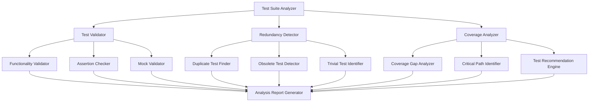

# Design Document

## Overview

The test suite optimization system will analyze the existing PsychoChauffeur bot test suite to identify issues, gaps, and improvement opportunities. The system will provide comprehensive analysis across three main areas: test validation, redundancy elimination, and coverage enhancement.

The current test suite has only 18% coverage with many critical modules having 0% coverage. The analysis reveals significant gaps in testing for core functionality including database operations, service registry, async utilities, caching systems, and message handlers.

## Architecture

### Core Components



### Analysis Pipeline

The system follows a multi-stage analysis pipeline:

1. **Test Discovery**: Scan and catalog all existing test files
2. **Code Analysis**: Parse source code to understand functionality
3. **Coverage Analysis**: Map tests to source code coverage
4. **Validation Analysis**: Evaluate test quality and accuracy
5. **Redundancy Analysis**: Identify duplicate and unnecessary tests
6. **Gap Analysis**: Find untested code paths and functionality
7. **Recommendation Generation**: Create prioritized improvement suggestions
8. **Report Generation**: Compile comprehensive analysis results

## Components and Interfaces

### Test Suite Analyzer

**Purpose**: Main orchestrator that coordinates all analysis components.

**Interface**:
```python
class TestSuiteAnalyzer:
    async def analyze_test_suite(self, project_path: str) -> AnalysisReport
    async def discover_tests(self) -> List[TestFile]
    async def analyze_source_code(self) -> List[SourceFile]
    async def generate_recommendations(self) -> List[Recommendation]
```

### Test Validator

**Purpose**: Validates that existing tests accurately represent program functionality.

**Key Functions**:
- Analyze test assertions against actual code behavior
- Identify tests that don't align with current implementation
- Validate mock usage and test isolation
- Check for proper async/await patterns in async tests

**Interface**:
```python
class TestValidator:
    async def validate_test_functionality(self, test_file: TestFile) -> ValidationResult
    async def check_assertions(self, test_method: TestMethod) -> List[AssertionIssue]
    async def validate_mocks(self, test_method: TestMethod) -> List[MockIssue]
```

### Redundancy Detector

**Purpose**: Identifies and categorizes redundant, obsolete, and trivial tests.

**Detection Strategies**:
- **Duplicate Detection**: Compare test logic, assertions, and coverage
- **Obsolete Detection**: Match tests against removed/deprecated code
- **Trivial Detection**: Identify tests with minimal validation value

**Interface**:
```python
class RedundancyDetector:
    async def find_duplicate_tests(self) -> List[DuplicateTestGroup]
    async def find_obsolete_tests(self) -> List[ObsoleteTest]
    async def find_trivial_tests(self) -> List[TrivialTest]
```

### Coverage Analyzer

**Purpose**: Analyzes code coverage and identifies gaps requiring new tests.

**Analysis Areas**:
- Statement coverage gaps
- Branch coverage gaps
- Exception path coverage
- Integration point coverage
- Critical business logic coverage

**Interface**:
```python
class CoverageAnalyzer:
    async def analyze_coverage_gaps(self) -> CoverageReport
    async def identify_critical_paths(self) -> List[CriticalPath]
    async def recommend_test_cases(self) -> List[TestRecommendation]
```

## Data Models

### Core Analysis Models

```python
@dataclass
class TestFile:
    path: str
    test_classes: List[TestClass]
    coverage_percentage: float
    issues: List[TestIssue]

@dataclass
class TestMethod:
    name: str
    test_type: TestType  # unit, integration, e2e
    assertions: List[Assertion]
    mocks: List[Mock]
    coverage_lines: Set[int]

@dataclass
class ValidationResult:
    is_valid: bool
    issues: List[ValidationIssue]
    recommendations: List[str]

@dataclass
class TestRecommendation:
    priority: Priority  # critical, high, medium, low
    test_type: TestType
    module: str
    functionality: str
    description: str
    rationale: str
    implementation_example: Optional[str]
```

### Issue Classification

```python
class IssueType(Enum):
    FUNCTIONALITY_MISMATCH = "functionality_mismatch"
    WEAK_ASSERTION = "weak_assertion"
    MOCK_OVERUSE = "mock_overuse"
    DUPLICATE_TEST = "duplicate_test"
    OBSOLETE_TEST = "obsolete_test"
    TRIVIAL_TEST = "trivial_test"
    MISSING_COVERAGE = "missing_coverage"
    ASYNC_PATTERN_ISSUE = "async_pattern_issue"
```

## Error Handling

### Error Categories

1. **Analysis Errors**: Issues during code parsing or test discovery
2. **Validation Errors**: Problems validating test functionality
3. **Coverage Errors**: Issues accessing or parsing coverage data
4. **File System Errors**: Problems reading test or source files

### Error Recovery Strategies

- **Graceful Degradation**: Continue analysis even if some components fail
- **Partial Results**: Return partial analysis when complete analysis fails
- **Error Reporting**: Include error details in final report
- **Retry Logic**: Retry failed operations with exponential backoff

### Error Handling Implementation

```python
class AnalysisError(Exception):
    def __init__(self, message: str, component: str, recoverable: bool = True):
        self.message = message
        self.component = component
        self.recoverable = recoverable

async def safe_analyze(analyzer_func: Callable) -> Optional[Any]:
    try:
        return await analyzer_func()
    except AnalysisError as e:
        if e.recoverable:
            logger.warning(f"Recoverable error in {e.component}: {e.message}")
            return None
        else:
            raise
```

## Testing Strategy

### Unit Tests

- **Test Validator Tests**: Verify correct identification of test issues
- **Redundancy Detector Tests**: Ensure accurate duplicate detection
- **Coverage Analyzer Tests**: Validate coverage gap identification
- **Report Generator Tests**: Verify correct report formatting

### Integration Tests

- **End-to-End Analysis**: Test complete analysis pipeline
- **File System Integration**: Test with real project structure
- **Coverage Tool Integration**: Test with actual coverage data

### Test Data Strategy

- **Mock Test Suites**: Create representative test files for testing
- **Sample Projects**: Use simplified project structures
- **Coverage Fixtures**: Pre-generated coverage data for testing

### Performance Testing

- **Large Codebase Testing**: Verify performance with large projects
- **Memory Usage Testing**: Ensure reasonable memory consumption
- **Concurrent Analysis**: Test parallel analysis capabilities

## Implementation Priorities

### Phase 1: Core Analysis (High Priority)
- Test discovery and cataloging
- Basic coverage analysis
- Simple redundancy detection
- Report generation framework

### Phase 2: Advanced Analysis (Medium Priority)
- Sophisticated test validation
- Complex redundancy patterns
- Critical path identification
- Detailed recommendations

### Phase 3: Enhancement Features (Low Priority)
- Interactive report features
- Integration with CI/CD
- Historical analysis tracking
- Custom rule configuration

## Integration Points

### Coverage Tools Integration
- **pytest-cov**: Primary coverage tool integration
- **Coverage.py**: Direct integration for detailed analysis
- **HTML Reports**: Parse existing HTML coverage reports

### Static Analysis Integration
- **AST Parsing**: Use Python AST for code analysis
- **Type Checking**: Integration with mypy for type analysis
- **Code Quality**: Integration with flake8/pylint metrics

### CI/CD Integration
- **GitHub Actions**: Integration for automated analysis
- **Report Artifacts**: Generate reports as CI artifacts
- **Quality Gates**: Fail builds on critical test issues