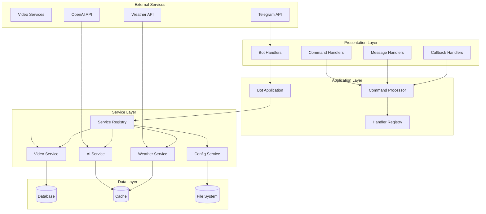
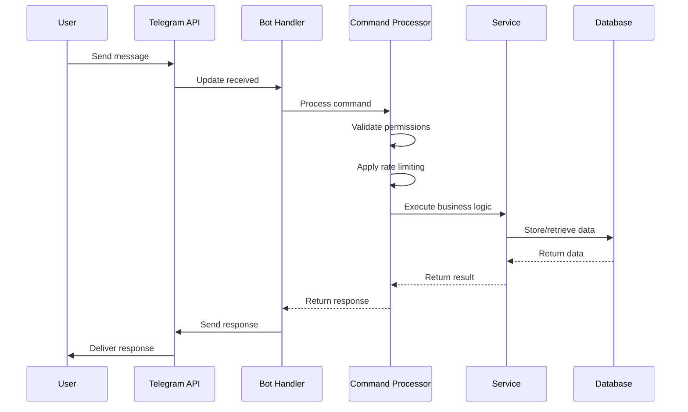
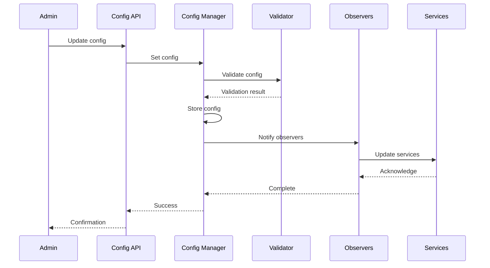
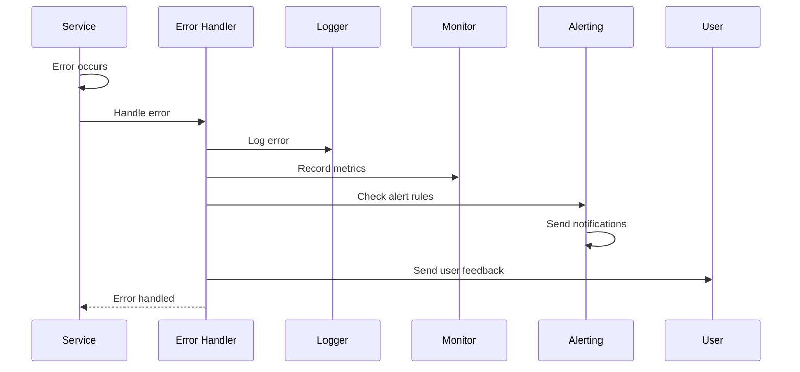

# System Architecture Documentation

This document provides a comprehensive overview of the PsychoChauffeur Bot architecture, design patterns, and system components.

## Table of Contents

1. [Architecture Overview](#architecture-overview)
2. [System Components](#system-components)
3. [Design Patterns](#design-patterns)
4. [Data Flow](#data-flow)
5. [Service Layer](#service-layer)
6. [Configuration Management](#configuration-management)
7. [Error Handling Strategy](#error-handling-strategy)
8. [Performance Architecture](#performance-architecture)
9. [Security Architecture](#security-architecture)
10. [Deployment Architecture](#deployment-architecture)

## Architecture Overview

The PsychoChauffeur Bot follows a **layered, service-oriented architecture** with clear separation of concerns and dependency injection throughout.

### High-Level Architecture



### Architectural Principles

1. **Separation of Concerns**: Each layer has a specific responsibility
2. **Dependency Injection**: Services are injected rather than directly instantiated
3. **Interface Segregation**: Small, focused interfaces rather than large ones
4. **Single Responsibility**: Each class has one reason to change
5. **Open/Closed Principle**: Open for extension, closed for modification
6. **Async-First**: Built with async/await patterns throughout

## System Components

### 1. Bot Application Layer

The top-level orchestrator that manages the entire bot lifecycle.

```python
class BotApplication:
    """Main application orchestrator."""
    
    def __init__(self, service_registry: ServiceRegistry):
        self.service_registry = service_registry
        self.telegram_app: Optional[Application] = None
    
    async def initialize(self) -> None:
        """Initialize all components and services."""
        
    async def start(self) -> None:
        """Start the bot and begin processing updates."""
        
    async def shutdown(self) -> None:
        """Gracefully shutdown all services."""
```

**Responsibilities:**
- Application lifecycle management
- Service initialization and shutdown
- Error handling and recovery
- Health monitoring

### 2. Service Registry

Dependency injection container that manages service creation and lifecycle.

```python
class ServiceRegistry:
    """Central service registry for dependency injection."""
    
    def register_singleton(self, name: str, service_type: Type[T]) -> 'ServiceRegistry':
        """Register a singleton service."""
        
    def register_transient(self, name: str, service_type: Type[T]) -> 'ServiceRegistry':
        """Register a transient service."""
        
    def get_service(self, name: str) -> Any:
        """Retrieve a service instance."""
```

**Features:**
- Multiple service scopes (singleton, transient, scoped)
- Automatic dependency resolution
- Circular dependency detection
- Service lifecycle management

### 3. Command Processing System

Standardized command handling with consistent error management.

```python
class CommandProcessor:
    """Centralized command processor."""
    
    def register_text_command(self, command: str, handler: Callable) -> 'CommandProcessor':
        """Register a text command handler."""
        
    def register_callback_handler(self, name: str, handler: Callable) -> 'CommandProcessor':
        """Register a callback query handler."""
        
    def register_message_handler(self, name: str, handler: Callable, filter) -> 'CommandProcessor':
        """Register a message handler with filter."""
```

**Features:**
- Unified command registration
- Permission checking
- Rate limiting
- Error handling decorators

### 4. Configuration Management

Hierarchical configuration system with inheritance and validation.

```python
class EnhancedConfigManager:
    """Enhanced configuration management with inheritance."""
    
    async def get_config(self, scope: ConfigScope, config_id: str) -> Dict[str, Any]:
        """Get configuration with inheritance."""
        
    async def set_config(self, scope: ConfigScope, config_id: str, config: Dict[str, Any]) -> bool:
        """Set configuration with validation."""
        
    async def get_effective_config(self, scope: ConfigScope, config_id: str) -> Dict[str, Any]:
        """Get effective configuration with all inheritance applied."""
```

**Features:**
- Hierarchical configuration inheritance
- Real-time configuration updates
- Configuration validation
- Backup and restore capabilities

## Design Patterns

### 1. Dependency Injection Pattern

Used throughout the system to reduce coupling and improve testability.

```python
# Service registration
service_registry.register_singleton('database', DatabaseService)
service_registry.register_singleton('video_service', VideoService, dependencies=['database'])

# Service usage
class VideoHandler:
    def __init__(self, video_service: VideoService):
        self.video_service = video_service
    
    async def handle_video_request(self, url: str) -> DownloadResult:
        return await self.video_service.download(url)
```

### 2. Factory Pattern

Used for creating complex objects and services.

```python
class ServiceFactory:
    """Factory for creating configured services."""
    
    @staticmethod
    def create_video_service(config: Dict[str, Any]) -> VideoService:
        """Create a configured video service."""
        return VideoService(
            download_dir=config['download_dir'],
            max_file_size=config['max_file_size'],
            timeout=config['timeout']
        )
```

### 3. Strategy Pattern

Used for different AI response strategies and processing algorithms.

```python
class AIStrategy(Protocol):
    """Strategy interface for AI processing."""
    
    async def generate_response(self, prompt: str, context: AIContext) -> AIResponse:
        """Generate AI response using this strategy."""

class GPTStrategy(AIStrategy):
    """GPT-based AI strategy."""
    
class ClaudeStrategy(AIStrategy):
    """Claude-based AI strategy."""

class AIService:
    def __init__(self, strategy: AIStrategy):
        self.strategy = strategy
    
    async def process_request(self, prompt: str) -> AIResponse:
        return await self.strategy.generate_response(prompt, context)
```

### 4. Observer Pattern

Used for configuration changes and event notifications.

```python
class ConfigChangeObserver(Protocol):
    """Observer for configuration changes."""
    
    async def on_config_changed(self, scope: str, config_id: str, new_config: Dict[str, Any]) -> None:
        """Handle configuration change."""

class ConfigManager:
    def __init__(self):
        self._observers: List[ConfigChangeObserver] = []
    
    def add_observer(self, observer: ConfigChangeObserver) -> None:
        self._observers.append(observer)
    
    async def _notify_observers(self, scope: str, config_id: str, config: Dict[str, Any]) -> None:
        for observer in self._observers:
            await observer.on_config_changed(scope, config_id, config)
```

### 5. Repository Pattern

Used for data access abstraction.

```python
T = TypeVar('T')

class Repository(Generic[T], Protocol):
    """Generic repository interface."""
    
    async def get_by_id(self, id: Any) -> Optional[T]:
        """Get entity by ID."""
    
    async def save(self, entity: T) -> T:
        """Save entity."""
    
    async def delete(self, id: Any) -> bool:
        """Delete entity by ID."""

class UserRepository(Repository[User]):
    """User-specific repository implementation."""
    
    async def get_by_username(self, username: str) -> Optional[User]:
        """Get user by username."""
```

### 6. Command Pattern

Used for encapsulating requests and supporting undo operations.

```python
class Command(Protocol):
    """Command interface."""
    
    async def execute(self) -> Any:
        """Execute the command."""
    
    async def undo(self) -> None:
        """Undo the command."""

class ConfigUpdateCommand(Command):
    """Command to update configuration."""
    
    def __init__(self, config_manager: ConfigManager, scope: str, config_id: str, new_config: Dict[str, Any]):
        self.config_manager = config_manager
        self.scope = scope
        self.config_id = config_id
        self.new_config = new_config
        self.old_config: Optional[Dict[str, Any]] = None
    
    async def execute(self) -> Any:
        self.old_config = await self.config_manager.get_config(self.scope, self.config_id)
        return await self.config_manager.set_config(self.scope, self.config_id, self.new_config)
    
    async def undo(self) -> None:
        if self.old_config:
            await self.config_manager.set_config(self.scope, self.config_id, self.old_config)
```

## Data Flow

### 1. Message Processing Flow



### 2. Configuration Update Flow



### 3. Error Handling Flow



## Service Layer

### Core Services

#### 1. Video Download Service

```python
class VideoDownloadService:
    """Service for downloading videos from various platforms."""
    
    async def download(self, url: str, options: DownloadOptions) -> DownloadResult:
        """Download video from URL."""
    
    async def get_info(self, url: str) -> VideoInfo:
        """Get video information without downloading."""
    
    async def get_supported_platforms(self) -> List[Platform]:
        """Get list of supported platforms."""
```

**Features:**
- Multi-platform support (YouTube, Twitter, Instagram, TikTok)
- Quality selection and format conversion
- Progress tracking and cancellation
- File size and duration limits
- Concurrent download management

#### 2. AI Service

```python
class AIService:
    """Service for AI-powered features."""
    
    async def generate_response(self, prompt: str, context: AIContext) -> AIResponse:
        """Generate AI response with context."""
    
    async def analyze_image(self, image_data: bytes) -> ImageAnalysis:
        """Analyze image content."""
    
    async def summarize_text(self, text: str) -> str:
        """Summarize long text content."""
```

**Features:**
- Multiple AI provider support (OpenAI, Claude, etc.)
- Context management and conversation history
- Token usage tracking and optimization
- Response caching and rate limiting
- Content filtering and safety checks

#### 3. Weather Service

```python
class WeatherService:
    """Service for weather information."""
    
    async def get_current_weather(self, location: str) -> WeatherData:
        """Get current weather for location."""
    
    async def get_forecast(self, location: str, days: int) -> WeatherForecast:
        """Get weather forecast."""
    
    async def get_weather_alerts(self, location: str) -> List[WeatherAlert]:
        """Get weather alerts for location."""
```

**Features:**
- Multiple weather provider support
- Location geocoding and validation
- Weather data caching
- Alert notifications
- Historical weather data

### Service Communication

Services communicate through well-defined interfaces and events:

```python
class ServiceEvent:
    """Base class for service events."""
    
    def __init__(self, source: str, event_type: str, data: Dict[str, Any]):
        self.source = source
        self.event_type = event_type
        self.data = data
        self.timestamp = datetime.now()

class EventBus:
    """Event bus for service communication."""
    
    def __init__(self):
        self._subscribers: Dict[str, List[Callable]] = {}
    
    def subscribe(self, event_type: str, handler: Callable) -> None:
        """Subscribe to events of a specific type."""
    
    async def publish(self, event: ServiceEvent) -> None:
        """Publish an event to all subscribers."""
```

## Configuration Management

### Configuration Hierarchy

```
Global Configuration
├── System Settings
├── Default Module Configurations
└── Feature Flags

Chat Configuration (inherits from Global)
├── Chat-specific Settings
├── Module Overrides
└── Custom Commands

User Configuration (inherits from Chat)
├── User Preferences
├── Personal Settings
└── Usage Statistics
```

### Configuration Schema

```python
class GlobalConfig(TypedDict):
    """Global configuration schema."""
    system_settings: SystemSettings
    default_modules: Dict[str, ModuleConfig]
    feature_flags: Dict[str, bool]

class ChatConfig(TypedDict):
    """Chat configuration schema."""
    chat_metadata: ChatMetadata
    config_modules: Dict[str, ModuleConfig]
    custom_commands: Dict[str, str]

class ModuleConfig(TypedDict):
    """Module configuration schema."""
    enabled: bool
    settings: Dict[str, Any]
    overrides: Dict[str, Any]
```

### Configuration Validation

```python
class ConfigValidator:
    """Configuration validator with schema support."""
    
    def __init__(self):
        self._schemas: Dict[str, Dict[str, Any]] = {}
    
    def register_schema(self, config_type: str, schema: Dict[str, Any]) -> None:
        """Register a configuration schema."""
    
    def validate(self, config_type: str, config: Dict[str, Any]) -> ValidationResult:
        """Validate configuration against schema."""
```

## Error Handling Strategy

### Error Classification

```python
class ErrorSeverity(Enum):
    LOW = "low"
    MEDIUM = "medium"
    HIGH = "high"
    CRITICAL = "critical"

class ErrorCategory(Enum):
    NETWORK = "network"
    DATABASE = "database"
    API = "api"
    INPUT = "input"
    PERMISSION = "permission"
    RESOURCE = "resource"
    GENERAL = "general"
```

### Error Handling Pipeline

1. **Error Detection**: Automatic error detection and classification
2. **Error Logging**: Structured logging with context
3. **Error Reporting**: User-friendly error messages
4. **Error Analytics**: Error tracking and pattern analysis
5. **Error Recovery**: Automatic retry and fallback mechanisms

### Error Decorators

```python
@handle_command_errors(feedback_message="Command failed, please try again")
@handle_network_errors("external_api", timeout=30.0, retry_count=3)
@handle_database_errors("user_query", fallback_value=None)
async def complex_operation():
    """Operation with comprehensive error handling."""
    pass
```

## Performance Architecture

### Performance Monitoring

```python
class PerformanceMonitor:
    """Comprehensive performance monitoring."""
    
    def __init__(self):
        self.metric_collector = MetricCollector()
        self.resource_monitor = ResourceMonitor()
        self.request_tracker = RequestTracker()
    
    async def track_request(self, operation: str) -> AsyncContextManager:
        """Track request performance."""
    
    async def get_performance_report(self) -> PerformanceReport:
        """Generate performance report."""
```

### Caching Strategy

```python
class CacheManager:
    """Multi-level caching system."""
    
    def __init__(self):
        self.l1_cache = MemoryCache()  # Fast, small capacity
        self.l2_cache = RedisCache()   # Medium speed, large capacity
        self.l3_cache = DatabaseCache() # Slow, persistent
    
    async def get(self, key: str) -> Optional[Any]:
        """Get value with cache hierarchy."""
    
    async def set(self, key: str, value: Any, ttl: Optional[int] = None) -> None:
        """Set value in appropriate cache level."""
```

### Async Optimization

```python
class AsyncTaskManager:
    """Manage async tasks and concurrency."""
    
    async def create_task(self, coro: Coroutine, name: str) -> str:
        """Create and track async task."""
    
    async def wait_for_task(self, task_id: str) -> Any:
        """Wait for task completion."""
    
    async def cancel_task(self, task_id: str) -> bool:
        """Cancel running task."""
```

## Security Architecture

### Input Validation

```python
class InputValidator:
    """Comprehensive input validation."""
    
    def validate_user_input(self, input_data: str) -> ValidationResult:
        """Validate user input for safety."""
    
    def sanitize_html(self, html_content: str) -> str:
        """Sanitize HTML content."""
    
    def validate_file_upload(self, file_data: bytes, filename: str) -> ValidationResult:
        """Validate uploaded files."""
```

### Rate Limiting

```python
class RateLimiter:
    """Advanced rate limiting system."""
    
    def __init__(self):
        self.user_limits: Dict[int, RateLimit] = {}
        self.global_limits: Dict[str, RateLimit] = {}
    
    async def check_rate_limit(self, user_id: int, operation: str) -> bool:
        """Check if operation is within rate limits."""
    
    async def apply_rate_limit(self, user_id: int, operation: str) -> None:
        """Apply rate limiting to operation."""
```

### Security Headers and Validation

```python
class SecurityManager:
    """Security management and validation."""
    
    def validate_api_key(self, api_key: str) -> bool:
        """Validate API key format and authenticity."""
    
    def encrypt_sensitive_data(self, data: str) -> str:
        """Encrypt sensitive data for storage."""
    
    def audit_log(self, action: str, user_id: int, details: Dict[str, Any]) -> None:
        """Log security-relevant actions."""
```

## Deployment Architecture

### Container Architecture

```dockerfile
# Multi-stage build for optimization
FROM python:3.10-slim as builder
WORKDIR /app
COPY requirements.txt .
RUN pip install --no-cache-dir -r requirements.txt

FROM python:3.10-slim as runtime
WORKDIR /app
COPY --from=builder /usr/local/lib/python3.10/site-packages /usr/local/lib/python3.10/site-packages
COPY . .
CMD ["python", "main_new.py"]
```

### Environment Configuration

```yaml
# docker-compose.yml
version: '3.8'
services:
  bot:
    build: .
    environment:
      - TELEGRAM_BOT_TOKEN=${TELEGRAM_BOT_TOKEN}
      - DATABASE_URL=postgresql://user:pass@db:5432/botdb
      - REDIS_URL=redis://redis:6379
    depends_on:
      - db
      - redis
    restart: unless-stopped
  
  db:
    image: postgres:13
    environment:
      - POSTGRES_DB=botdb
      - POSTGRES_USER=user
      - POSTGRES_PASSWORD=pass
    volumes:
      - postgres_data:/var/lib/postgresql/data
  
  redis:
    image: redis:6-alpine
    volumes:
      - redis_data:/data

volumes:
  postgres_data:
  redis_data:
```

### Monitoring and Observability

```python
class ObservabilityStack:
    """Comprehensive observability setup."""
    
    def __init__(self):
        self.metrics_collector = PrometheusMetrics()
        self.trace_collector = JaegerTracing()
        self.log_aggregator = ElasticsearchLogs()
    
    async def setup_monitoring(self) -> None:
        """Setup monitoring infrastructure."""
    
    async def health_check(self) -> HealthStatus:
        """Perform comprehensive health check."""
```

## Conclusion

This architecture provides:

1. **Scalability**: Modular design allows for easy scaling of individual components
2. **Maintainability**: Clear separation of concerns and well-defined interfaces
3. **Testability**: Dependency injection and interface-based design enable comprehensive testing
4. **Reliability**: Comprehensive error handling and monitoring
5. **Performance**: Async-first design with caching and optimization
6. **Security**: Multiple layers of security validation and protection

The architecture is designed to evolve with changing requirements while maintaining stability and performance.